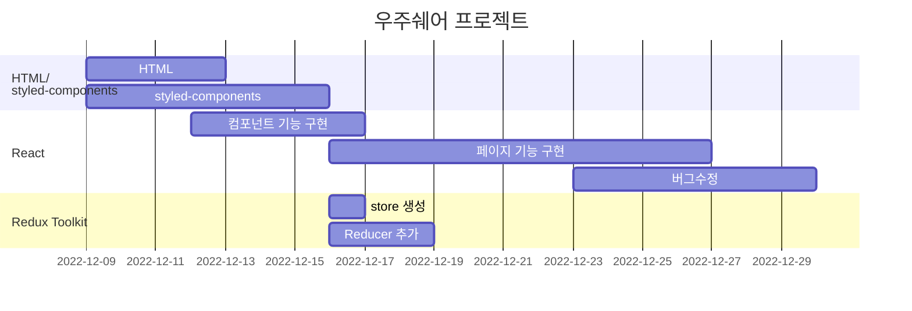

## 1.1 프로젝트 소개
**배포링크 : https://main--wouldumarket.netlify.app/**


# Would you share?


> 👀 에어팟을 껴야... 능률이 올라가는 편입니다.. 👀   
> ’능률이 필요할 때 주변에서 빌릴수 있으면 좋겠다..’


**우주쉐어(Would you share)** 는 소중한 물건들과 그 물건이 필요한 사람들을 연결하여 가치를 창출할 수 있는 물품대여 플랫폼입니다.

공유하고 싶은 물건을 등록하고, 그에 담긴 추억을 피드에 남길 수 있습니다. 비슷한 관심사를 가진 사람들과 소통하고 대화하며, 물건을 빌릴 수 있습니다.

필요한 물건을 대여하는 사람이 주변에 없다면, 게시글로 요청할 수 있습니다. 물건을 가지고 있다는 사실을 잊었던 사람들도 도와줄 거예요.

## 1.2 팀원소개
| 한호수 | 남서연 | 임종서 | 오혜윤 |
| :---: | :---: | :---: | :---: |
|||||
|Github:  <a href="https://github.com/tnghgks">[ HOSU HAN ] </a>| Github: <a href="https://github.com/Seo-Chan">[ Seo-Chan ] </a> | Github: <a href="https://github.com/K10SEO">[ JongSeo IM ]</a>  | Github: <a href="https://github.com/oohhy">[ oohhy ]</a>|
## 1.3 역할분담

### 공통

- **Login**
    - 정규 표현식으로 이메일, 비밀번호 유효성 검사
    - 서버에서 유저 정보 데이터를 받아 회원가입 된 유저인지 확인
    - 회원가입 된 유저라면 로그인 후 feed페이지로 이동
- **Register**
    - 이메일 중복 검증 기능
    - 이메일 / 비밀번호 정규표현식을 통한 유효성 검사

### 한호수

- **프로젝트 리드**
- **User Profile**
    - Redux-Toolkit을 사용하여 하위 컴포넌트들에게 State를 Props-drilling 없이 전달
    - 프로필에 접근한 유저의 권한에 따라 팔로우,언팔로우 또는 프로필 수정, 상품 등록 버튼을 랜더링함
    - 사용자의 게시물들을 앨범뷰로 전환하여 사진들만 모아서 볼 수 있음
- **Follow,Following**
    - 동일한 UI라서 두 컴포넌트로 나뉘지 않고 Follow 컴포넌트 하나로 처리함
    - Router에서 접근하는 URL에 따라서 Follow 데이터를 보여줄지 Following 데이터를 보여줄지 정함
    - 팔로워 또는 팔로잉 숫자가 많다면 무한 스크롤 기능을 사용하여 부분적으로 불러올 수 있음
- **Search**
    - 최근 검색해 확인한 유저를 LocalStorage에 저장하여 재접속 후에도 볼 수 있음
    - Redux-Toolkit의 createAsyncThunk 함수를 사용하여 비동기 통신 후 Store 바로 저장될 수 있게 함
    - 키워드를 빠르게 입력할 시 이전 키워드의 데이터가 더 많다면 늦게 로딩되어 덮어 씌워지는 이슈가 발생함 ⇒ 이전 비동기 통신을 AbortController를 사용해 취소시키는 방법으로 해결
- **Post Detail**
    - 게시물의 소유자인지 여부에 따라 신고 또는 삭제를 할 수 있도록 모달 및 기능을 만듬
    - 댓글 기능을 추가하였음
    - Post Image가 두개 이상일 시 Left,Right 버튼을 사용하여 사진을 탐색할 수 있게 만듬
- **페이지별 모달창 구현**
    - 페이지별로 모달을 랜더링하며 Redux State에 모달이 열려 있는지 여부에 따라 랜더링함

### 남서연

- **프로젝트 아이디어 기획**
- **Register**
    - Input값 미입력 시 버튼 비활성화
- **SetProfile**
    - 계정ID 중복 검증 기능
    - 사용자이름 / 계정ID 정규표현식을 통한 유효성 검사
    - 프로필 이미지 업로드 및 미리보기 기능 구현
    - 회원가입 및 프로필 등록 완료 시 로그인 상태로 전환 기능 구현
    - Input값 미입력 시 버튼 비활성화
- **Feed**
    - 팔로잉 유무에 따른 페이지 렌더링 기능 구현
        - 팔로잉이 있을 경우 팔로잉 유저들의 게시글 불러오기
        - 팔로잉이 없을 경우 기본 피드 렌더링
- **HomePost**
    - 게시글 상세 페이지 구현
    - 게시글 작성자를 클릭할 경우 해당 유저의 프로필로 이동되도록 구현
    - 게시글 업로드 날짜 기능 구현
    - 사용자 게시글의 좋아요 및 좋아요 취소 기능 구현

### 임종서

- **세부 컴포넌트 UI**
    - 마크업 및 스타일 구현
        - TabMenu 컴포넌트
        - Comment 댓글창 컴포넌트
    - 마크업 및 스타일링, props 속성 추가로 리소스 최소화 할 수 있도록 구현
        - CommonInput 인풋창 컴포넌트
        - UserSearch, UserFollow 컴포넌트
        - CommonButton 버튼 컴포넌트
- **EditProduct, AddProduct**
    - 유저 저장 데이터 와 입력시 price값에 콤마 기능 구현
    - 정규표현식을 사용하여 숫자만 입력될 수 있는 기능 구현
    - 판매링크 유효성 검사 기능 구현
- **Page 공통 기능( EditUserProfile, EditProduct, AddProduct)**
    - input 포커스 시 하이라이트 기능 구현
    - nput value가 없을 시 Button을 비활성화 시키는 유효성 검사 구현
    - 경고창(유효성 검사를 통과하지 못한 상태)이 떠있는 상태일 때 onsubmit 되지 않게 구현
    - 유저가 회원가입 당시 저장한 데이터를 수정 프로필 페이지 연결 시 보여주는 기능 구현
    - FileReader를 사용한 프로필 이미지 미리보기 기능 구현
    - 수정한 데이터로 서버 통신 할 수 있는 store 생성 및 기능 구현
- **Page UI 마크업 및 스타일링**
    - ChatList
    - ChatRoom
    - Page404

### 오혜윤

- **Navbar**
    - 뒤로가기 버튼→ 이전 페이지로 이동 기능 구현
    - 검색 버튼→ 검색 페이지로 이동 기능 구현
    - 페이지마다 사용할 수 있게 컴포넌트화
- **Splash Screen**
    - 로그인 O → 피드로 연결 / 로그인 X → 로그인 및 회원가입 화면으로 연결
- **Login**
    - 아이디, 비밀번호 입력 없을 시 버튼 비활성화
    - ID 입력창 auto focus 기능 구현
- **Post Upload**
    - 포스트 업로드 기능 구현
    - Filereader로 이미지 미리보기 및 미리보기 삭제 기능 구현
    - 업로드 버튼 클릭할 때 서버에 이미지 등록(미리 보기 할 때는 등록 X)
    - 이미지 파일 없을 시 업로드 버튼 비활성화
    - 이미지 파일 3개 초과, 파일 용량 초과시 alert창 구현
    - 텍스트 입력창 auto focus 기능 구현

## 기능 시연
<div>

|0. Splash|1. 회원가입|2. 로그인|
|:---:|:---:|:---:|
||||


<br>


|3. 홈 피드|4. 계정 검색|4-1. 무한스크롤|
|:---:|:---:|:---:|
||| |


<br>

|5. 상품 등록|5-1. 상품 수정|5-2. 상품 삭제
|:---:|:---:|:---:|
||| 

<br>

|5-3. 상품 상세|6. 게시글 등록|6-1. 게시글 삭제|
|:---:|:---:|:---:|
||| 

<br>

|7.팔로잉, 팔로워 리스트,팔로우 기능|8. 에러페이지|9. 좋아요 기능|
|:---:|:---:|:---:|
||| 
	
<br>

|10. 댓글 생성|10-1. 댓글 신고|10-2 댓글 삭제|
|:---:|:---:|:---:|
||| 

<br>

|12. 게시글 신고|13. 채팅 목록 UI, 모달|14. 로그아웃|
|:---:|:---:|:---:|
||| 

</div>

<br>

## 기술스택

|          **Front-End** |          **Back-End** |          **협업 관리** |             **디자인** |
| --- | --- | --- | --- |
|- React </br> - Styled-components </br> - Redux-Tookit | - 제공된 API 사용 | - git </br> - Github </br> - Github Issues </br> - Discord </br> - Notion|- Figma </br> - Illustrator|

## 스택 사용 근거

> **협업 전략**
> 

[**Git Flow]**

팀원들 모두 협업에 대한 경험이 없어 대표적인 전략인 **Git Flow**를 사용 하게 되었습니다.
**Git Flow** 전략은 크게 5가지 브랜치로 나뉘지만 프로젝트 규모가 크지 않아 다음 3개의 브랜치만 사용하였습니다.

- **main**: 배포된 버전의 코드를 가지고있는 브랜치
- **develop**: 다음 버전에 최신화 할 최신 코드를 가지고 있는 브랜치
- **feature**: 기능 개발 브랜치로 생성, merge가 되면 삭제되는 브랜치

[**컨벤션]**

- Notion을 사용해 컨벤션, 회의록, 작업 일정 분할 등 기록하여 사용
- Commit message컨벤션,  함수명 컨벤션, font-size rem  등 코드를 통일 하여 유지 보수 시 리소스 최소화 및 가독성을 증가 시켰습니다.
- Github Issues, git Commit, Pull requests 등 템블릿을 사용 하여 리소스 최소화 하였습니다.

[**Discord**]

- 음성채널 및 채팅으로 실시간 회의 진행
- 화면 공유를 통해 페어프로그래밍 및 코드리뷰 진행

> **HTTP 통신 Axios vs Fetch**
> 

저희팀은 **Fetch** 를 채택하였습니다.
Axios 를 사용하게 되면 JSON 타입 변경 같은 코드들을 빼고 간결하게 적을 수 있지만
HTTP 통신 기본 로직에 대해 더 공부가 필요하다 생각하여 Fetch를 사용 하였습니다.
프로젝트 완성 후 Axios로 migration 하여 중복되는 코드의 양을 줄일 계획입니다.

> **Why Redux-tookit?**
> 

프로젝트 시작 전, 실무에서 많이 사용되는 스택들을 찾아보았고 Redux가 가장 많이 사용되고 있었습니다. Redux를 프로젝트에 적용 시키기에는 작은 프로젝트 기간이라 생각 하였지만, Redux의 로직을 경험해보고자 복잡도가 적은 Redux tookit을 사용하였습니다.

- Ducks 패턴 사용
- 보일러플레이트 코드에 의한 복잡도 감소
- tookit 내장 라이브러리로 인한 ****의존성 감소

## 개발기간

- 2022.12.09 - 2023.01.06

```
## 📖 Gantt Chart :fire:



## 폴더구조

```plain Text
📦src
 ┣ 📂Components
 ┃ ┣ 📂Auth
 ┃ ┣ 📂Button
 ┃ ┣ 📂Chat
 ┃ ┣ 📂ImageComponents
 ┃ ┣ 📂Input
 ┃ ┣ 📂Logo
 ┃ ┣ 📂Navbar
 ┃ ┣ 📂icon
 ┣ 📂Pages
 ┃ ┣ 📂AddProduct
 ┃ ┣ 📂Chat
 ┃ ┃ ┣ 📂ChatList
 ┃ ┃ ┗ 📂ChatRoom
 ┃ ┣ 📂EditProduct
 ┃ ┃ ┣ 📂EditProductInput
 ┃ ┃ ┣ 📂ProductImg
 ┃ ┣ 📂EditUserProfile
 ┃ ┣ 📂Follows
 ┃ ┣ 📂Home
 ┃ ┣ 📂Login
 ┃ ┣ 📂LoginEmail
 ┃ ┣ 📂Page404
 ┃ ┣ 📂PostDetail
 ┃ ┃ ┣ 📂CommentItem
 ┃ ┣ 📂PostUpload
 ┃ ┣ 📂Register
 ┃ ┣ 📂Search
 ┃ ┣ 📂SetProfile
 ┃ ┣ 📂SplashScreen
 ┃ ┃ ┣ 📂SplashLoader
 ┃ ┗ 📂UserProfile
 ┃ ┃ ┣ 📂EditBtns
 ┃ ┃ ┣ 📂FollowBtns
 ┃ ┃ ┣ 📂UserInfo
 ┃ ┃ ┣ 📂UserPost
 ┃ ┃ ┣ 📂UserProducts
 ┣ 📂Router
 ┣ 📂assets
 ┃ ┣ 📂icon
 ┣ 📂cookie
 ┣ 📂store
 ┣ 📜App.js
 ┗ 📜index.js
```
