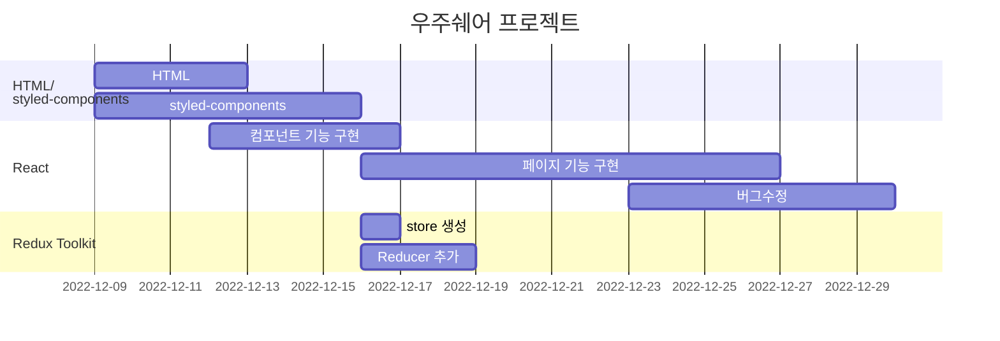

# 🖥프로젝트 소개


**배포 링크 : https://main--wouldumarket.netlify.app/**   
**테스트 계정 : share123@naver.com**   
**비밀번호 : Lion1234!**   

# Would you share?


> 👀 에어팟을 껴야... 능률이 올라가는 편입니다.. 👀   
> ’능률이 필요할 때 주변에서 빌릴수 있으면 좋겠다..’


**우주쉐어(Would you share)** 는 소중한 물건들과 그 물건이 필요한 사람들을 연결하여 가치를 창출할 수 있는 물품대여 플랫폼입니다.

공유하고 싶은 물건을 등록하고, 그에 담긴 추억을 피드에 남길 수 있습니다. 비슷한 관심사를 가진 사람들과 소통하고 대화하며, 물건을 빌릴 수 있습니다.

필요한 물건을 대여하는 사람이 주변에 없다면, 게시글로 요청할 수 있습니다. 물건을 가지고 있다는 사실을 잊었던 사람들도 도와줄 거예요.

# 1.1 팀원소개
| 한호수 | 남서연 | 임종서 | 오혜윤 |
| :---: | :---: | :---: | :---: |
|||||
|Github:  <a href="https://github.com/tnghgks">[ HOSU HAN ] </a>| Github: <a href="https://github.com/Seo-Chan">[ Seo-Chan ] </a> | Github: <a href="https://github.com/K10SEO">[ JongSeo IM ]</a>  | Github: <a href="https://github.com/oohhy">[ oohhy ]</a>|

# 1.2 역할분담


## 공통

- **Login**
    - 정규 표현식으로 이메일, 비밀번호 유효성 검사
    - 서버에서 유저 정보 데이터를 받아 회원가입 된 유저인지 확인
    - 회원가입 된 유저라면 로그인 후 feed페이지로 이동
- **Register**
    - 이메일 중복 검증 기능
    - 이메일 / 비밀번호 정규표현식을 통한 유효성 검사

## 한호수

- **프로젝트 리드**
- **User Profile**
    - Redux-Toolkit을 사용하여 하위 컴포넌트들에게 State를 Props-drilling 없이 전달
    - 프로필에 접근한 유저의 권한에 따라 팔로우,언팔로우 또는 프로필 수정, 상품 등록 버튼을 랜더링함
    - 사용자의 게시물들을 앨범뷰로 전환하여 사진들만 모아서 볼 수 있음
- **Follow,Following**
    - 동일한 UI라서 두 컴포넌트로 나뉘지 않고 Follow 컴포넌트 하나로 처리함
    - Router에서 접근하는 URL에 따라서 Follow 데이터를 보여줄지 Following 데이터를 보여줄지 정함
    - 팔로워 또는 팔로잉 숫자가 많다면 무한 스크롤 기능을 사용하여 부분적으로 불러올 수 있음
- **Search**
    - 최근 검색해 확인한 유저를 LocalStorage에 저장하여 재접속 후에도 볼 수 있음
    - Redux-Toolkit의 createAsyncThunk 함수를 사용하여 비동기 통신 후 Store 바로 저장될 수 있게 함
    - 키워드를 빠르게 입력할 시 이전 키워드의 데이터가 더 많다면 늦게 로딩되어 덮어 씌워지는 이슈가 발생함 ⇒ 이전 비동기 통신을 AbortController를 사용해 취소시키는 방법으로 해결
- **Post Detail**
    - 게시물의 소유자인지 여부에 따라 신고 또는 삭제를 할 수 있도록 모달 및 기능을 만듬
    - 댓글 기능을 추가하였음
    - Post Image가 두개 이상일 시 Left,Right 버튼을 사용하여 사진을 탐색할 수 있게 만듬
- **페이지별 모달창 구현**
    - 페이지별로 모달을 랜더링하며 Redux State에 모달이 열려 있는지 여부에 따라 랜더링함

## 남서연

- **프로젝트 아이디어 기획**
- **Register**
    - Input값 미입력 시 버튼 비활성화
- **SetProfile**
    - 계정ID 중복 검증 기능
    - 사용자이름 / 계정ID 정규표현식을 통한 유효성 검사
    - 프로필 이미지 업로드 및 미리보기 기능 구현
    - 회원가입 및 프로필 등록 완료 시 로그인 상태로 전환 기능 구현
    - Input값 미입력 시 버튼 비활성화
- **Feed**
    - 팔로잉 유무에 따른 페이지 렌더링 기능 구현
        - 팔로잉이 있을 경우 팔로잉 유저들의 게시글 불러오기
        - 팔로잉이 없을 경우 기본 피드 렌더링
- **HomePost**
    - 게시글 상세 페이지 구현
    - 게시글 작성자를 클릭할 경우 해당 유저의 프로필로 이동되도록 구현
    - 게시글 업로드 날짜 기능 구현
    - 사용자 게시글의 좋아요 및 좋아요 취소 기능 구현

## 임종서

- **세부 컴포넌트 UI**
    - 마크업 및 스타일 구현
        - TabMenu 컴포넌트
        - Comment 댓글창 컴포넌트
    - 마크업 및 스타일링, props 속성 추가로 리소스 최소화 할 수 있도록 구현
        - CommonInput 인풋창 컴포넌트
        - UserSearch, UserFollow 컴포넌트
        - CommonButton 버튼 컴포넌트
- **EditProduct, AddProduct**
    - 유저 저장 데이터 와 입력시 price값에 콤마 기능 구현
    - 정규표현식을 사용하여 숫자만 입력될 수 있는 기능 구현
    - 판매링크 유효성 검사 기능 구현
- **Page 공통 기능( EditUserProfile, EditProduct, AddProduct)**
    - input 포커스 시 하이라이트 기능 구현
    - input value가 없을 시 Button을 비활성화 시키는 유효성 검사 구현
    - 경고창(유효성 검사를 통과하지 못한 상태)이 떠있는 상태일 때 onsubmit 되지 않게 구현
    - 유저가 회원가입 당시 저장한 데이터를 수정 프로필 페이지 연결 시 보여주는 기능 구현
    - FileReader를 사용한 프로필 이미지 미리보기 기능 구현
    - 수정한 데이터로 서버 통신 할 수 있는 store 생성 및 기능 구현
- **Page UI 마크업 및 스타일링**
    - ChatList
    - ChatRoom
    - Page404

## 오혜윤

- **Navbar**
    - 뒤로가기 버튼→ 이전 페이지로 이동 기능 구현
    - 검색 버튼→ 검색 페이지로 이동 기능 구현
    - 페이지마다 사용할 수 있게 컴포넌트화
- **Splash Screen**
    - 로그인 O → 피드로 연결 / 로그인 X → 로그인 및 회원가입 화면으로 연결
- **Login**
    - 아이디, 비밀번호 입력 없을 시 버튼 비활성화
    - ID 입력창 auto focus 기능 구현
- **Post Upload**
    - 포스트 업로드 기능 구현
    - FileReader로 이미지 미리보기 및 미리보기 삭제 기능 구현
    - 업로드 버튼 클릭할 때 서버에 이미지 등록(미리 보기 할 때는 등록 X)
    - 이미지 파일 없을 시 업로드 버튼 비활성화
    - 이미지 파일 3개 초과, 파일 용량 초과시 alert창 구현
    - 텍스트 입력창 auto focus 기능 구현

# 📖 개발기간 :fire:

**2022.12.09 - 2023.01.06**

#### Gantt Chart




# 🎬 기능 시연
<div>

|0. Splash|1. 회원가입|2. 로그인|
|:---:|:---:|:---:|
||||


<br>


|3. 홈 피드|4. 계정 검색|4-1. 무한스크롤|
|:---:|:---:|:---:|
||| |


<br>

|5. 상품 등록|5-1. 상품 수정|5-2. 상품 삭제
|:---:|:---:|:---:|
||| 

<br>

|5-3. 상품 상세|6. 게시글 등록|6-1. 게시글 삭제|
|:---:|:---:|:---:|
||| 

<br>

|7.팔로잉, 팔로워 리스트,팔로우 기능|8. 에러페이지|9. 좋아요 기능|
|:---:|:---:|:---:|
||| 
	
<br>

|10. 댓글 생성|10-1. 댓글 신고|10-2 댓글 삭제|
|:---:|:---:|:---:|
||| 

<br>

|12. 게시글 신고|13. 채팅 목록 UI, 모달|14. 로그아웃|
|:---:|:---:|:---:|
||| 

</div>

<br>

# ⚙ 기술스택

|          **Front-End** |          **Back-End** |          **협업 관리** |             **디자인** | **배포**|
| --- | --- | --- | --- | --- |
|React </br> Styled-components </br> Redux-Tookit | 제공된 API 사용 | git </br> Github </br> Github Issues </br> Discord </br> Notion| Figma </br> Illustrator | netlify |

# 🔊 스택 사용 근거

## Front-End 기술 스택

> **React**

처음에 해당 프로젝트를 새로고침이 없고 화면 깜빡임이 없는 SPA로 제작하기로 결정하였을때 Vanilla JS와 React 사이에서 고민을 했는데 협업을 위해 컴포넌트 기반 프로그래밍을 결정 했고 처음부터 구현하는 Vanilla JS 보단 이미 구현되어있고 커뮤니티가 활성화 된 React로 결정하게 되었습니다. 그 외 이유로는 React 프로젝트 경험이 부족해서 학습의 목적으로 선택하게 된 영향도 있습니다.

> **Redux-Toolkit**

컴포넌트 단위로 프로그래밍 하다보니 컴포넌트 단위가 늘어날수록 하위 컴포넌트로 정보를 내려주는 방법인 Props-Drilling 을 하면 중복되는 코드가 늘고 복잡성이 늘어나는걸 깨달았습니다. 이때, 전역 상태관리 도구의 필요성을 느꼇고 배우기 쉽고 사용하기 쉬운 Recoil이 현재 프로젝트 규모에 맞다고 생각되었지만 현업에서 많이 쓰이는 Redux의 로직을 공부해보고자 Redux-Toolkit으로 결정하게 되었습니다.

> **styled-components**

styled-components를 사용한 이유는 CSS-in-JS 방식으로 스타일 코드와 리액트 코드를 같이 관리 할 수 있고 SASS 문법을 사용할 수 있기 때문에 확장성에서 유리하다고 생각하여 사용하게 되었습니다. 또한 컴포넌트 단위로 스타일을 정의할 수 있기 때문에 Class Name의 중복으로 인한 오류를 피할 수 있기 때문에 사용하였습니다.

## 협업 전략

> **Git Flow**

팀원들이 각각 한가지 기능을 개발 할 때마다 **feature** 브랜치를 만들어 작업하고 **develop** 브랜치에서 합친 뒤 기존 **feature** 브랜치는 삭제하는 방식을 사용하였습니다. **Git Flow** 전략은 보통 5가지 브랜치로 나뉘지만 프로젝트 규모가 크지 않아 간소화 하여 3개의 브랜치만 사용하였습니다.

- **main**: 배포된 버전의 코드를 가지고있는 브랜치
- **develop**: 다음 버전에 최신화 할 최신 코드를 가지고 있는 브랜치
- **feature**: 기능 개발 브랜치로 생성, merge가 되면 삭제되는 브랜치

> **컨벤션**

- Notion을 사용해 컨벤션, 회의록, 작업 일정 분할 등 기록하여 사용
- Commit message컨벤션,  함수명 컨벤션, font-size rem  등 코드를 통일 하여 유지 보수 시 리소스 최소화 및 가독성을 증가 시켰습니다.
- GitHub Issues, git Commit, Pull requests 등 템블릿을 사용 하여 리소스 최소화 하였습니다.

> **Discord**

- 음성채널 및 채팅으로 실시간 회의 진행
- 화면 공유를 통해 페어프로그래밍 및 코드리뷰 진행
- 팀원들과 새로운 서버를 만들어 웹훅을 통한 Git Push 알람

## 배포

> **netlify**

GitHub Pages 와 netlify 둘 중에서 고민하였지만 도메인에 레파지토리명이 꼭 들어가는 GitHub Pages 와는 달리 같은 무료 도메인을 자유롭게 커스텀 할 수 있어서 해당 도구를 이용하였습니다.

## 그 외 기술 사용 근거


> **HTTP 통신 Axios vs Fetch**

저희팀은 **Fetch** 를 채택하였습니다.
Axios 를 사용하게 되면 JSON 타입 변경 같은 코드들을 빼고 간결하게 적을 수 있지만
HTTP 통신 기본 로직에 대해 더 공부가 필요하다 생각하여 Fetch를 사용 하였습니다.
프로젝트 완성 후 Axios로 migration 하여 중복되는 코드의 양을 줄일 계획입니다.

# 🏹 트러블 슈팅

### 오혜윤

#### 1.  이미지 파일 미리보기 삭제 후 재등록 불가 이슈

- **문제**
    - PostUpload 페이지에서 이미지 미리보기를 구현할 때, 미리보기를 삭제한 이미지 파일을 다시 등록하니 미리보기가 되지 않습니다.
- **원인**
    - 이미지 미리보기 기능은 input에 달아둔 onChange 이벤트 핸들러 함수이기 때문에 이벤트 타겟인 files에 변화가 있을 때만 이벤트가 발생하여 동작합니다.
    - 미리보기 이미지를 삭제하기 위해 DeleteBtn을 클릭하는 것은, base64로 변환되어 UI 상으로 이미지를 미리보기 해주고 있는 imageList에서 해당 파일을 삭제하는 것이기 때문에 실제 이벤트 타겟인 files에는 아무런 영향이 없습니다.
    - 미리보기 이미지를 지웠다가 다시 등록해도 브라우저 입장에서는 이미 존재 파일을 다시 등록하는 것이기 때문에 files의 변화를 감지하지 못하여 미리보기가 동작하지 않습니다.
- **해결**
    - 미리보기 업로드 후 files를 빈 문자열로 초기화해주면 미리보기 이미지를 삭제하고 나서 다시 미리보기 등록을 시도해도 정상적으로 동작합니다.

### 남서연

#### 1.  Warning: Each child in a list should have a unique "key" prop.

- **문제**
    - Feed 페이지에 팔로잉 한 유저들의 게시물을 불러오려고 map함수를 사용했더니 에러문구가 떴습니다.
- **원인**
    - React는 key prop을 사용하여 컴포넌트와 DOM 요소 간의 관계를 생성하고 불필요한 리렌더링을 방지하기 때문에, 자식 컴포넌트마다 고유의 key 값을 입력해 줘야 합니다.
- **해결**
    - 자식 컴포넌트마다 고유의 key값을 부여하였습니다. index가 아닌 id를 key값으로 넣은 이유는 배열의 index를 key값으로 사용하는 것은 지양해야하기 때문입니다. 항목들이 재배열될 경우 index도 바뀌고 컴포넌트마다 고유해야 하는 key값도 같이 바뀌기 때문에 리액트는 리렌더링 해야하는 컴포넌트를 헷갈려 잘못된 컴포넌트를 리렌더링 할 수 있습니다.

#### 2. 빈배열이 true값을 반환하여 생긴 이슈

- **문제**
    - Feed 페이지에서 팔로잉이 없을 때 렌더링 되어야하는 기본 화면이 뜨지 않는 현상이 있었습니다.
- **원인**
    - 유저가 팔로잉이 있을 경우 게시글이 뜨도록 조건문을 작성해놨는데 following은 배열이었기 때문에 빈배열일 경우 true값을 반환하며 아무것도 뜨지 않았습니다.
- **해결**
    - 배열에 length 속성과 ‘!!’를 사용하여 배열의 길이를 boolean타입으로 변환하도록 하였습니다.

### 임종서

#### 1.  ****A component is changing an uncontrolled input to be controlled.****

- **문제**
    - 수정 페이지에서 유저가 저장한 데이터 값을 가져와 input value 로  넣어주게 될 때 value 의 값이 undefined 가 들어가며 에러가 뜸
    - useEffect를 사용해 useState 함수를 실행 시키고 의존성 배열로 빈 배열로 넣어주게 되었음 처음 마운트 될 때 useState에 값이 담기게 되고 값이 제대로 전달 될거라 생각함
    - 처음 페이지 들어갈 때는 유저의 데이터를 가져오지 못하고 나갔다 다시 들어올 때 가져오게 됨
- **원인**
    - 의존성 배열을 빈 배열로 넣어준게 원인이었음, 유저의 데이터를 useSelector 로 가져 오게 되는데 useState 안에 useSelector로 가져온 유저 데이터를 넣어주게 됨
    - 빈 배열을 넣어줌으로 유저의 데이터를 가져오기 전에 useState가 동기적으로 먼저 실행 되어 undefined 값이 출력되게 되었었던 것이다
- **해결**
    - 의존성 배열의 값으로 useSelector로 선언한 선언 명을 넣어줌 useSelector의 값이 담길 때 useEffect가 실행하며 정상적으로 작동

### 한호수

#### 1. ****A non-serializable value was detected in the state****

- **문제**
    - 모달을 각 페이지별로 만들어야하는데 제일 아래 컴포넌트에 Props-drilling 하는 코드가 보기 싫어서 Redux State에 콜백함수를 넣음
    - 각각의 모달 선택지(삭제,신고,수정 등등)에 맞은 리듀서를 만들고 액션 타입에 맞추어 디스패치하면 잘동작할꺼라고 생각함
    - 결론적으로 동작은 하나 에러를 띄움
    
    
    
- **원인**
    - Redux의 state에는 직렬화 할 수 없는 값(non-serializable)을 넣으면 안된다고 경고함
    - Redux-DevTools에서 state값을 비교할 때 직렬화해서 사용하는데 직렬화 할 수 없는 값이 들어가면 시간여행 디버깅 등 기능을 사용 할 수 없고 올바르게 작동한다고 보장 할 수 없음
- **해결**
    - 첫번째, 권장하는대로 Redux State에 함수를 저장하는게 아닌 컴포넌트간에 Props-drilling를 사용하여 전달해서 사용
    - 두번째, Redux-DevTools가 올바르게 동작하는것에 관심이 없다면 Redux의 직렬화를 확인하는 기본 미들웨어에서 각 액션들을 예외처리한다.
    - 세번째, 약간 편법이지만 createAsyncThunk를 사용하여 내부에 함수를 작성하여 작동하게 할 수 있다.
- **결론**
    - Redux-DevTools가 올바르게 동작하는것에 관심이 없고, 다른 미들웨어들을 사용할때 발생하는 추가적인 오류를 감안할 수 있다면 Redux 공식문서에서도 State에 직렬화 할 수 없는 값을 넣어도 상관없다는 글이 쓰여있다.

> 공식사이트 인용글
[https://redux.js.org/faq/organizing-state#can-i-put-functions-promises-or-other-non-serializable-items-in-my-store-state](https://redux.js.org/faq/organizing-state#can-i-put-functions-promises-or-other-non-serializable-items-in-my-store-state)
> 

#### 2. 서치페이지에서 이전 키워드가 더 늦게 응답이 오는경우

- **문제**
    - 검색을 할 때 마다 키워드 하이라이트 기능이 제대로 작동하지 않아서 보니 “ab”를 검색했는데 “a”로 검색했을 때와 같은 결과를 보여주고 있었다.
- **원인**
    - “ab” 라는 키워드를 검색한다고 하면 “a” 문자열이 비동기 통신 후 가져오는 배열의 길이는 890개이고 “b”라는 키워드는 300개 정도 밖에 되지않아 “b”가 먼저 통신이 끝나서 랜더링 후 “a”키워드의 데이터들이 재 랜더링 되면서 덮어쓰게된다.
- **해결**
    - AbortController 객체를 사용하여 새로 데이터를 요청한다면 이전 비동기 통신을 취소하는 방법으로 해결 하였다.
- **실제 사용된 코드**
    
    ```jsx
    useEffect(() => {
        if (signal) signal.abort(); // signal 이라는 state에 이전 통신이 있다면 취소
    
        let controller = new AbortController(); // AbortController 객체를 만든다.
    		//Redux-Toolkit을 사용해서 비동기 통신을 보낼때 signal이라는 정보를 fetch에 옵션으로 준다.
        dispatch(asyncSearchFetch({ searchInput, token, signal: controller.signal }));
        setSignal(controller); //signal state에 현재 AbortController 인스턴스를 저장한다.
      }, [searchInput]);
    ```
    
    ```jsx
    
    export const asyncSearchFetch = createAsyncThunk("searchDataSlice/asyncSearchFetch", async ({ searchInput, token, pageNum = 1, signal = null }) => {
      try {
        const response = await fetch(`https://mandarin.api.weniv.co.kr/user/searchuser/?keyword=${searchInput}`, {
          method: "GET",
          headers: {
            Authorization: `Bearer ${token}`,
            "Content-type": "application/json",
          },
          signal, // 컴포넌트에서 dispatch를 통해 넘겨준 signal을 fetch 옵션으로 추가한다.
        });
        const users = await response.json();
    
        return users.slice(pageNum * 100, pageNum * 100 + 100);
      } catch (error) {
        if (error.name === "AbortError") {
          return []; // 취소되었을때 에러명이 AbortError라면 빈배열을 리턴한다.
        }
        console.log(error);
      }
    });


# 👀 느낀점
## 호수

> 처음 협업 프로젝트를 시작할 때 리드를 맡게되면서 어떻게 할지 몰라서 많이 긴장했는데 팀원분들이 많이 도와주셔서 감사하게도 끝까지 갈 수 있었습니다.재미있었고 값진 경험이 된 것 같아서 오래오래 기억에 남을 것 같습니다. 여기서 끝내지 않고 계획했던 목표까지 프로젝트를 다듬어 나가면 좋을 것 같습니다.
> 

## 혜윤

> 프로젝트 시작하기 전에는 할 수 있을지 불안했지만, 항상 모르는 게 있으면 같이 해보자고 해준 팀장님과 페어 프로그래밍하면서 같이 고민해준 서연님, 종서님 덕분에 지치지 않고 프로젝트 기간 보낼 수 있었습니다. 감사합니다.
> 

## 서연

> 처음엔 기능을 어떻게 구현해야할지조차 어려워서 걱정이 많았는데 팀원들이 함께 도와준 덕분에 즐겁게 프로젝트를 할 수 있었습니다. 필수기능만이라도 끝까지 구현해보자 하고 시작을 했는데 하다보니 욕심이 더 생기는 것 같습니다. 이후에도 팀원들이랑 최적화나 새로운 기능들을 더 추가해서 발전시켜보고 싶습니다. 도와주신 모든분들 감사합니다.
> 

## 종서

> 단순한 기능 하나 제대로 다루지 못해 긴장과 걱정이 많았었는데 팀원들과 저를 도와주신 멋사분들 덕분에 제대로 된 기능들을 구현 할 수 있었습니다.  심도 있게 물어보시면 잘 대답하지 못 할 거 같지만 코드 로직에 대한 방향성을 많이 배우게 됐고 잘 모르는 기능이라 해도 시도해 볼 수 있는 자신감이 생긴 거 같습니다. 물음표 살인마였던 제 물음표를 받아주신 팀원분들에게 감사드립니다.
>


# 🗂 폴더구조

```
```plain Text
📦src
 ┣ 📂Components
 ┃ ┣ 📂Auth
 ┃ ┣ 📂Button
 ┃ ┣ 📂Chat
 ┃ ┣ 📂ImageComponents
 ┃ ┣ 📂Input
 ┃ ┣ 📂Logo
 ┃ ┣ 📂Navbar
 ┃ ┣ 📂icon
 ┣ 📂Pages
 ┃ ┣ 📂AddProduct
 ┃ ┣ 📂Chat
 ┃ ┃ ┣ 📂ChatList
 ┃ ┃ ┗ 📂ChatRoom
 ┃ ┣ 📂EditProduct
 ┃ ┃ ┣ 📂EditProductInput
 ┃ ┃ ┣ 📂ProductImg
 ┃ ┣ 📂EditUserProfile
 ┃ ┣ 📂Follows
 ┃ ┣ 📂Home
 ┃ ┣ 📂Login
 ┃ ┣ 📂LoginEmail
 ┃ ┣ 📂Page404
 ┃ ┣ 📂PostDetail
 ┃ ┃ ┣ 📂CommentItem
 ┃ ┣ 📂PostUpload
 ┃ ┣ 📂Register
 ┃ ┣ 📂Search
 ┃ ┣ 📂SetProfile
 ┃ ┣ 📂SplashScreen
 ┃ ┃ ┣ 📂SplashLoader
 ┃ ┗ 📂UserProfile
 ┃ ┃ ┣ 📂EditBtns
 ┃ ┃ ┣ 📂FollowBtns
 ┃ ┃ ┣ 📂UserInfo
 ┃ ┃ ┣ 📂UserPost
 ┃ ┃ ┣ 📂UserProducts
 ┣ 📂Router
 ┣ 📂assets
 ┃ ┣ 📂icon
 ┣ 📂cookie
 ┣ 📂store
 ┣ 📜App.js
 ┗ 📜index.js
```
